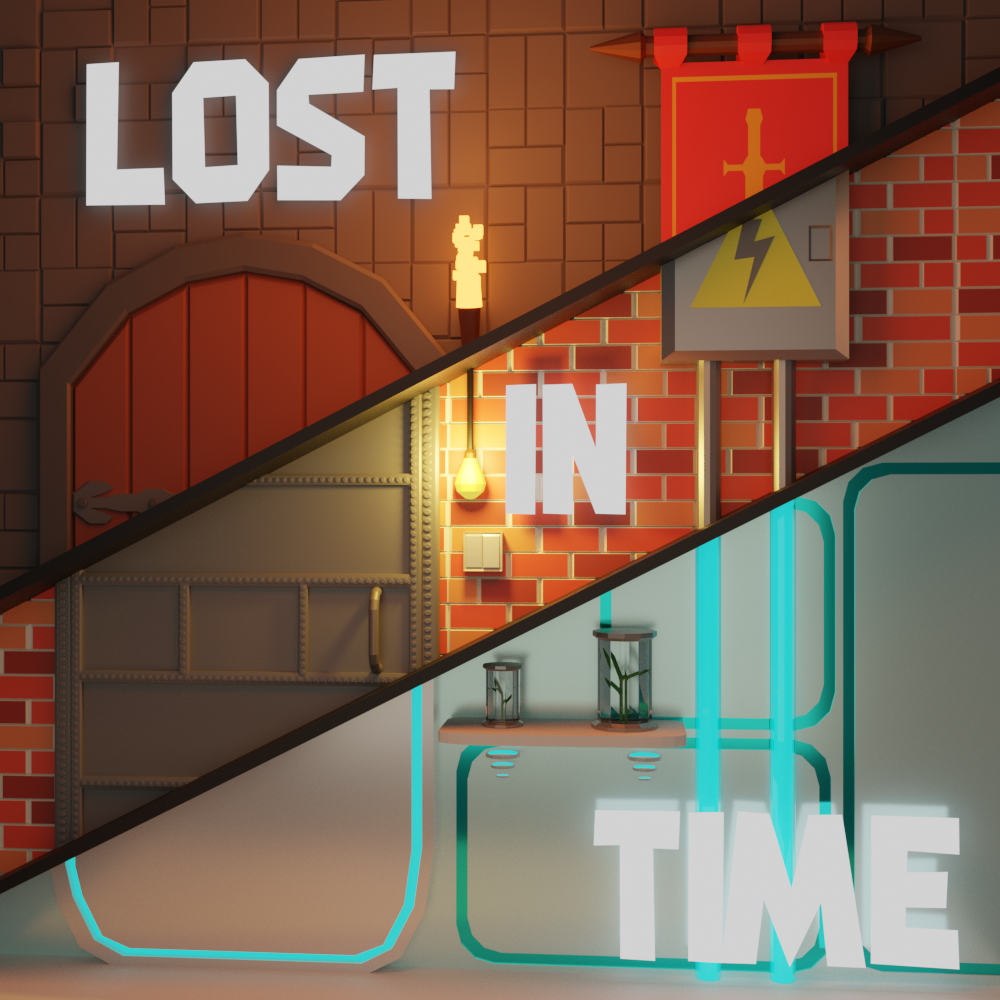
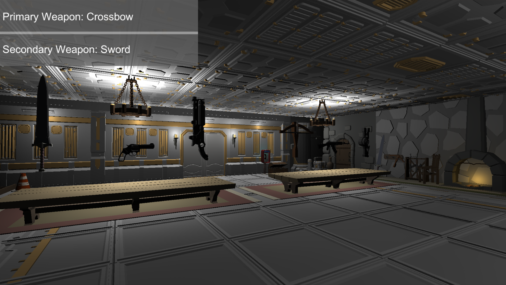
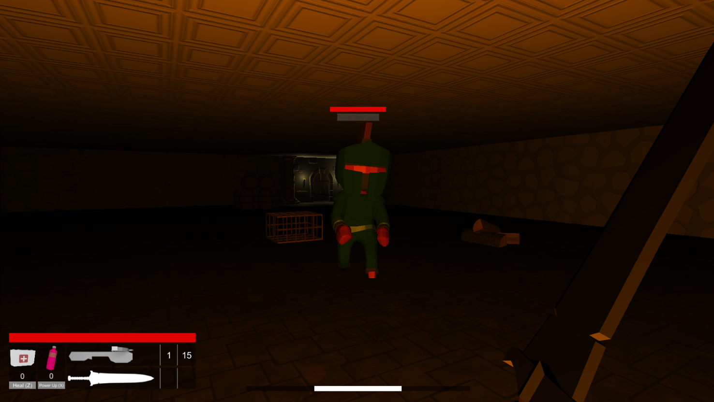

# LostInTime
A game made as part of the group project for Politechnika Częstochowska

# Description
The game is a first-person shooter which focuses on gameplay in locations across three diffrent time periods allowing you to keep your equipment. 
Three times across which gameplay takes place:
* Medival
* Modern
* Future

# Current state of the game:
* Tutorial (which can be skipped)
* Three diffrent levels and a player hub
* Early version of quest system
* Six diffrent weapon (two from each time period)
* One Boss fight
* Three diffrent enemies 
* Two special variants of enemies (faster or stronger than regular version)

# Preview

### [Trailer video](https://www.youtube.com/watch?v=8ja0p29xRpY&ab_channel=Hajcik)

### [Gameplay video](https://www.youtube.com/watch?v=s91gCxBFUZU&ab_channel=Hajcik)

---

### **Logo**

---

### **Lobby**

---

### **User Interface**

---
